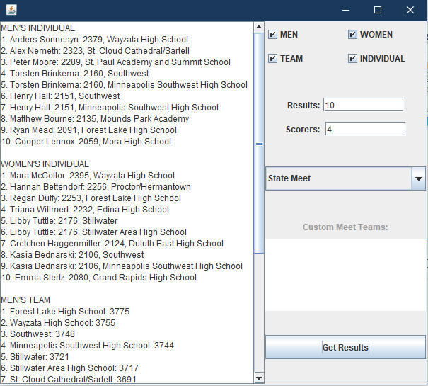

# Skier_Ranker
Java software to rank skiers in the MNHSL.

## Description

The Ski Ranker software includes three Java files.

##### OnlineReader.java
This code must be run first to construct the database of skiers in the MNHSL and their teams. It scrapes data directly from the MNHSL website and uses this data to construct a database of MN skiers with columns "First Name", "Last Name", "Team", and "Elo Score".

##### Input.java
This code handles the processing of race results. First, race results are downloaded as CSVs and placed into one of five folders, labeled "small meets", "important meets", "national meets", "conference champs", and "section champs". Input.java reads the CSVs from these folders chronologically and uses them to update the Elo scores of skiers in the skier database. In order to interpret the CSVs, which can be written in a variety of formats, an algorithm is used to identify important columns in the data and determine when multiple races are present in a single file.

##### Ranker.java
This class defines code for the main GUI. The GUI displays results from a simulated virtual meet. Users can modify the virtual meet in a number of ways, including selecting which teams participate and how many skiers score.

